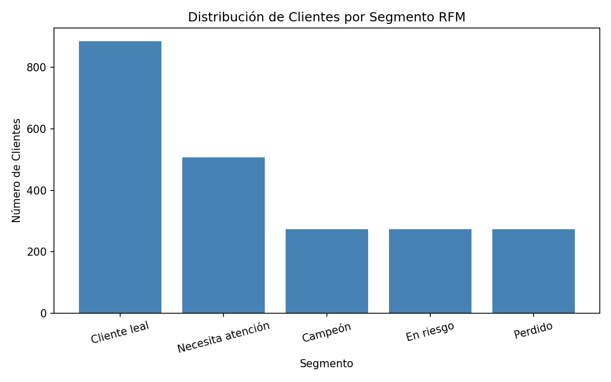
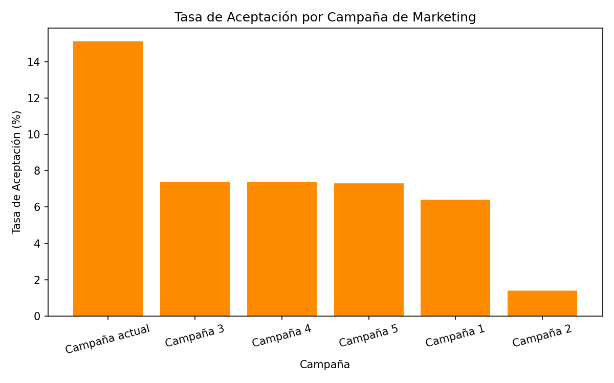
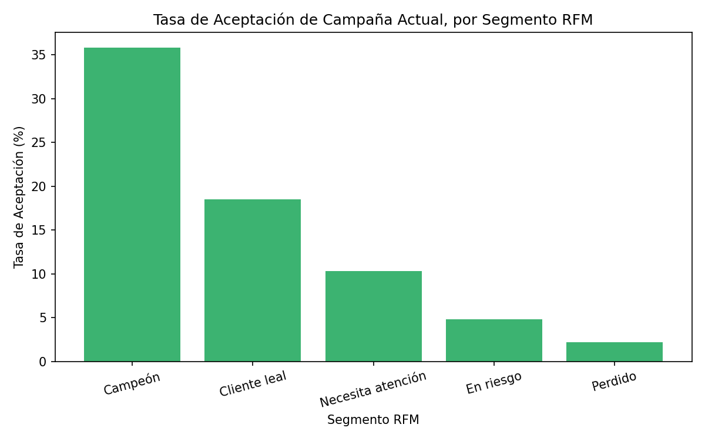

# Customer & Campaign Analytics

Análisis de segmentación de clientes y performance de campañas de marketing, usando SQL (PostgreSQL) para el procesamiento y análisis de datos, y Python para la carga, conexión y visualización.

## Objetivo

Identificar qué clientes son más valiosos para el negocio (segmentación RFM), evaluar qué tan efectivas han sido las campañas de marketing históricas, y analizar si existe relación entre el valor de un cliente y su probabilidad de responder a una nueva campaña.

## Dataset

Customer Personality Analysis (Kaggle), 2,240 registros de clientes con datos demográficos, historial de compras por categoría de producto, y respuesta a 6 campañas de marketing distintas.

Fuente: https://www.kaggle.com/datasets/imakash3011/customer-personality-analysis

El dataset no se incluye en este repositorio. Para reproducir el proyecto, descárgalo desde el link anterior y colócalo en `data/marketing_campaign.csv`.

## Stack técnico

- PostgreSQL — almacenamiento y queries de análisis
- Python (pandas, SQLAlchemy, matplotlib) — limpieza de datos, conexión a la base de datos, visualización
- Jupyter Notebook — desarrollo y documentación del análisis

## Estructura del proyecto

├── data/ # Dataset (no incluido en el repo, ver sección Dataset)
├── docs/ # Gráficos generados
├── scripts/ # Notebooks de Python
│ ├── 01_exploracion_inicial.ipynb
│ └── 02_analisis_visualizacion.ipynb
├── sql/ # Scripts SQL
│ ├── 01_create_tables.sql
│ ├── 02_load_data.sql
│ ├── 03_rfm_segmentation.sql
│ └── 04_campaign_performance.sql
└── README.md

## Proceso

### 1. Limpieza de datos

Se identificaron y corrigieron los siguientes problemas en el dataset original (2,240 registros):

- 24 registros sin valor de ingreso (`Income`) — eliminados
- 4 registros con valores atípicos evidentes (clientes con más de 120 años de edad, o ingreso reportado de 666,666) — eliminados
- 2 columnas constantes sin valor analítico (`Z_CostContact`, `Z_Revenue`) — eliminadas
- Conversión de fecha de registro de cliente de texto a tipo fecha

Dataset final: 2,212 registros.

### 2. Segmentación RFM

Se calculó un score de Recencia, Frecuencia y Valor Monetario (RFM) para cada cliente, usando cuartiles (función `NTILE` de SQL), y se clasificó a cada cliente en uno de cinco segmentos de negocio.

**Distribución de clientes por segmento:**

| Segmento | Clientes | % del total |
|---|---|---|
| Cliente leal | 885 | 40.0% |
| Necesita atención | 507 | 22.9% |
| Campeón | 274 | 12.4% |
| En riesgo | 273 | 12.3% |
| Perdido | 273 | 12.3% |

### 3. Performance de campañas

Se calculó la tasa de aceptación de cada una de las 5 campañas históricas y de la campaña más reciente.

La campaña más reciente obtuvo una tasa de aceptación de 15.1%, notablemente superior a las 5 campañas históricas (entre 1.4% y 7.4%).

### 4. Relación entre segmento RFM y aceptación de campaña

Se cruzó la segmentación RFM con la tasa de aceptación de la campaña más reciente, para evaluar si el valor histórico del cliente predice su probabilidad de conversión.

| Segmento | Tasa de aceptación |
|---|---|
| Campeón | 35.8% |
| Cliente leal | 18.5% |
| Necesita atención | 10.3% |
| En riesgo | 4.8% |
| Perdido | 2.2% |

## Hallazgos principales

- Existe una relación clara y consistente entre el segmento RFM de un cliente y su probabilidad de aceptar una nueva campaña: los "Campeones" convierten a una tasa 16 veces mayor que los clientes "Perdidos".
- El 40% de la base de clientes se clasifica como "Cliente leal", el segmento más numeroso.
- Solo el 12.4% de los clientes son "Campeones", pero representan el segmento de mayor probabilidad de conversión — un objetivo prioritario para campañas futuras.
- La campaña más reciente tuvo mejor desempeño que todas las campañas históricas, lo que sugiere una mejora en el targeting o en la oferta.

## Cómo reproducir el análisis

1. Descargar el dataset (ver sección Dataset) y colocarlo en `data/marketing_campaign.csv`
2. Crear la base de datos en PostgreSQL y ejecutar `sql/01_create_tables.sql`
3. Ejecutar `scripts/01_exploracion_inicial.ipynb` para limpiar los datos y generar `data/marketing_campaign_clean.csv`
4. Cargar los datos limpios con `sql/02_load_data.sql`
5. Ejecutar `scripts/02_analisis_visualizacion.ipynb` para generar las visualizaciones
